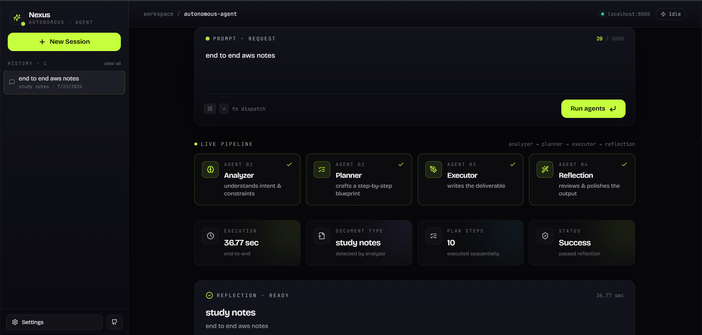
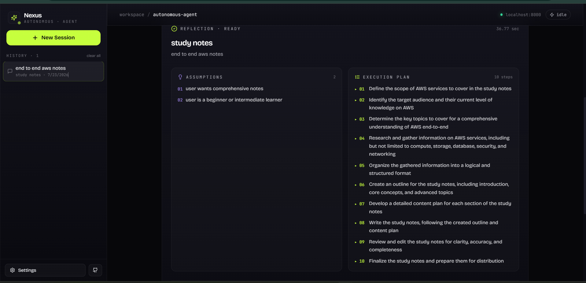
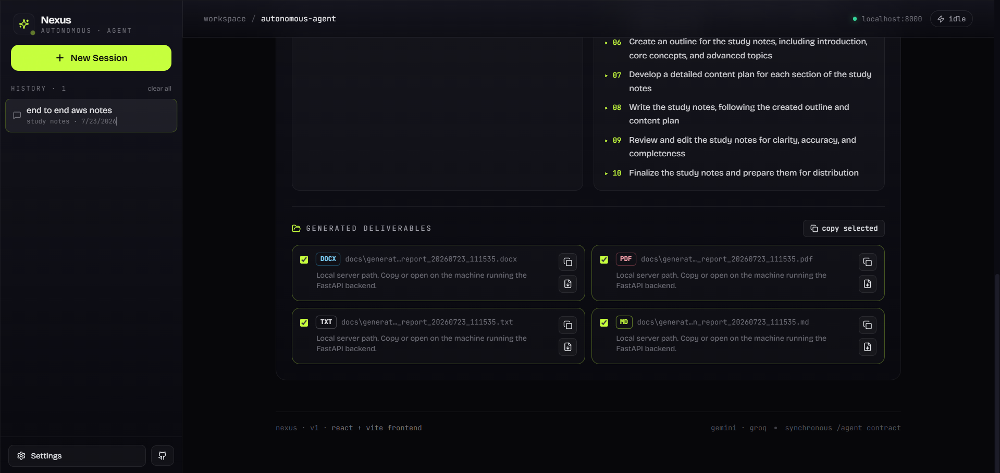

# 🤖 Autonomous AI Agent

<p align="center">


</p>

---

# 🚀 Overview

**Autonomous AI Agent** is a production-style **multi-agent AI document generation platform** built using **FastAPI**, **React**, **Gemini**, and **Groq**.

Instead of directly generating text, the system follows an autonomous reasoning workflow:

- 🧠 Understands the user's request
- 📋 Creates its own execution plan
- ✍ Generates a professional business document
- 🔍 Reviews and improves its own work
- 📄 Exports the final result into multiple document formats

The application also provides a modern React dashboard to monitor the complete execution process.

---

# ✨ Features

- 🤖 Multi-Agent AI Architecture
- 🧠 Autonomous Planning
- 📑 Business Document Generation
- 🔍 Reflection / Self Review
- ⚡ Gemini + Groq Automatic Fallback
- 🔁 Retry Logic with Exponential Backoff
- 📄 DOCX Generation
- 📕 PDF Generation
- 📝 Markdown Generation
- 📃 TXT Generation
- ⚙ FastAPI REST API
- 📚 Swagger Documentation
- ✅ Request Validation using Pydantic
- 🎨 Modern React Dashboard
- 📊 Execution Timeline
- 📈 Performance Metrics
- 🌙 Responsive Dark UI

---

# 🏗 System Architecture

```text
                    User Request
                          │
                          ▼
                 FastAPI REST Endpoint
                          │
                          ▼
                  Autonomous Orchestrator
                          │
     ┌────────────────────┼────────────────────┐
     ▼                    ▼                    ▼
 Analyzer             Planner             Executor
     │                    │                    │
     └────────────────────┼────────────────────┘
                          ▼
                  Reflection Agent
                          │
                          ▼
                 Document Generator
                          │
          ┌───────────────┼───────────────┐
          ▼               ▼               ▼
        DOCX             PDF            TXT
                          │
                          ▼
                  React Dashboard
```

---

# 🔄 Agent Workflow

## 1️⃣ Analyzer

The Analyzer understands the user's natural language request.

It extracts:

- Goal
- Document Type
- Business Context
- Missing Information
- Assumptions

---

## 2️⃣ Planner

The Planner creates an execution strategy before writing any content.

Example:

```
1. Analyze requirements
2. Define objectives
3. Estimate resources
4. Perform risk assessment
5. Generate recommendations
```

---

## 3️⃣ Executor

The Executor follows the generated execution plan and produces the complete document.

---

## 4️⃣ Reflection Agent

The Reflection Agent reviews the generated content and checks for:

- Completeness
- Grammar
- Professional Tone
- Missing Sections
- Consistency
- Readability

If improvements are required, the document is rewritten before final delivery.

---

# 🖥 Dashboard

The frontend provides an interactive dashboard that includes:

- Prompt Workspace
- AI Execution Timeline
- Live Status Updates
- Generated Document Preview
- Metrics Cards
- Logs Viewer
- Download Panel
- Settings Modal

---

# 📸 Screenshots

## Dashboard

> Add screenshot here

```

```

---

## Live Pipeline

> Add screenshot here

```

```

---

## Reflection

> Add screenshot here

```

```

---

# 📂 Project Structure

```text
autonomous-ai-agent/

├── backend/
│
│   ├── app/
│   │
│   ├── agents/
│   ├── models/
│   ├── prompts/
│   ├── routes/
│   ├── tools/
│   ├── utils/
│   ├── generated_docs/
│   │
│   ├── main.py
│   ├── config.py
│   └── api.py
│
├── frontend/
│
│   ├── src/
│   │
│   ├── components/
│   ├── context/
│   ├── pages/
│   ├── services/
│   ├── styles/
│   │
│   ├── App.jsx
│   ├── main.jsx
│   └── index.css
│
├── docs/
├── tests/
├── README.md
├── requirements.txt
└── .env
```

---

# 🛠 Technology Stack

## Backend

- Python 3.13
- FastAPI
- Pydantic v2
- Uvicorn

## Frontend

- React
- Vite
- Tailwind CSS
- Framer Motion
- Lucide Icons
- Sonner

## AI Models

- Gemini 2.5 Flash
- Groq (Llama 3.3 70B)

## Document Generation

- python-docx
- ReportLab

---

# ⚙ Installation

Clone the repository

```bash
git clone https://github.com/yourusername/autonomous-ai-agent.git
```

Move inside the project

```bash
cd autonomous-ai-agent
```

Create virtual environment

```bash
python -m venv venv
```

Activate

Windows

```bash
venv\Scripts\activate
```

Linux / macOS

```bash
source venv/bin/activate
```

Install dependencies

```bash
pip install -r requirements.txt
```

---

# 🔑 Environment Variables

Create a `.env` file.

```env
GEMINI_API_KEY=your_key

GROQ_API_KEY=your_key

GEMINI_MODEL=gemini-2.5-flash

GROQ_MODEL=llama-3.3-70b-versatile
```

---

# ▶ Running the Backend

```bash
uvicorn app.main:app --reload
```

Runs on

```
http://localhost:8000
```

---

# ▶ Running the Frontend

```bash
cd frontend

npm install

npm run dev
```

Runs on

```
http://localhost:5173
```

---

# 📚 API Documentation

Swagger UI

```
http://localhost:8000/docs
```

ReDoc

```
http://localhost:8000/redoc
```

---

# 📌 REST API

## POST

```
/agent
```

Example Request

```json
{
  "request": "Create a business proposal for launching an AI healthcare startup."
}
```

Example Response

```json
{
  "status": "Success",
  "document_type": "Business Proposal",
  "execution_time": "18.42 sec",
  "reflection": true,
  "generated_files": {
    "docx": "generated_docs/report.docx",
    "pdf": "generated_docs/report.pdf",
    "txt": "generated_docs/report.txt",
    "md": "generated_docs/report.md"
  }
}
```

---

# 📄 Generated Documents

Each execution automatically exports

- DOCX
- PDF
- TXT
- Markdown

Example

```
generated_docs/

business_report_20260723_141520.docx

business_report_20260723_141520.pdf

business_report_20260723_141520.txt

business_report_20260723_141520.md
```

---

# ⚡ Engineering Highlights

✅ Autonomous Multi-Agent Workflow

✅ Self Reflection Agent

✅ Retry Logic

✅ Automatic Gemini → Groq Fallback

✅ Structured JSON Validation

✅ Business Document Generation

✅ Responsive React Dashboard

✅ REST API

✅ Modular Architecture

✅ Clean Separation of Concerns

---

# 🧪 Example Prompts

### Business Proposal

```
Create a business proposal for launching an AI healthcare startup.
```

---

### AWS Migration Plan

```
Prepare a complete project plan for migrating a medium-sized e-commerce company to AWS.

The company has around 250 employees.

Budget has not been finalized.

The migration deadline is flexible.

Some business requirements are missing.

Make reasonable assumptions wherever necessary.

Include:

- Risk Assessment
- Timeline
- Cost Estimation
- Responsibilities
- Recommendations
```

---

# 📈 Roadmap

- [x] Multi-Agent Architecture
- [x] Gemini Integration
- [x] Groq Fallback
- [x] Reflection Agent
- [x] Retry Logic
- [x] DOCX Export
- [x] PDF Export
- [x] Markdown Export
- [x] TXT Export
- [x] React Dashboard
- [ ] Streaming Responses
- [ ] Conversation Memory
- [ ] RAG Integration
- [ ] Vector Database
- [ ] Tool Calling
- [ ] Docker Support
- [ ] CI/CD Pipeline
- [ ] Kubernetes Deployment
- [ ] Authentication

---

# 📊 Assignment Coverage

| Requirement | Status |
|------------|--------|
| Autonomous AI Agent | ✅ |
| FastAPI REST API | ✅ |
| Multi-Agent Workflow | ✅ |
| Reflection Agent | ✅ |
| Retry Logic | ✅ |
| Gemini + Groq Fallback | ✅ |
| DOCX Generation | ✅ |
| PDF Generation | ✅ |
| Markdown Generation | ✅ |
| TXT Generation | ✅ |
| Pydantic Validation | ✅ |
| React Frontend | ✅ |

---

# 👨‍💻 Author

**Himanshu**

B.Tech Artificial Intelligence & Machine Learning

**Tech Stack**

- Python
- FastAPI
- React
- Machine Learning
- AI Agents
- AWS

---

# 📄 License

This project is licensed under the **MIT License**.

---

## ⭐ If you found this project useful, consider giving it a star!